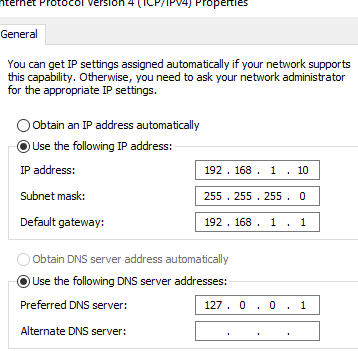
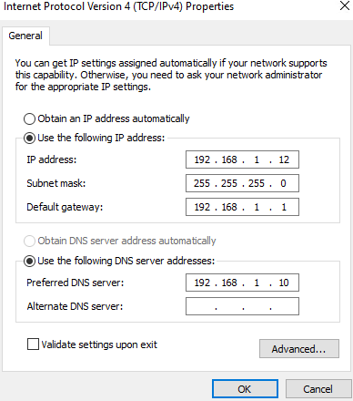
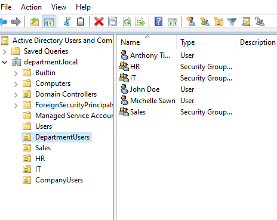
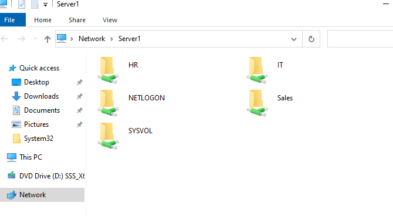

# Buisness-IT-Infrastructure
Virtualized Windows server and network environment built in Hyper-V. I simulated a coporate environment demonstrating real-world it support and admin skills.

---

- Configured Active Directory Domain Services
- Creating and managing user accounts and groups
- Testing network connectivity
- Setting up DNS and DHCP for IP assignment
- Configured multiple Remote Desktop connections to access my server

---

## Server01 IP Configuration

---
## Client01 IP Configuration

---
## Client02 IP Configuration

---
## 
Active Directory Users and Groups
Structure inside department.local users and groups where organized

---
## User Access and Folder Security
Folders shared from my server and linked to Active Directory security groups each department
has access to it's own shared resources so no unauthorized access across departments.

