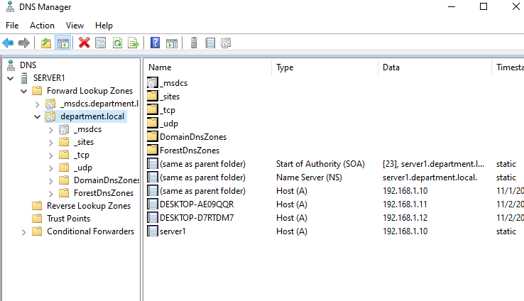

# Buisness-IT-Infrastructure
Virtualized Windows server and network environment built in Hyper-V. I simulated a coporate environment demonstrating real-world it support and admin skills.

---
- Assigned IPS configured DHCP for PCs and verified connectivity using ping
- Configured Active Directory Domain Services
- Creating and managing user accounts and groups
- Testing network connectivity
- Setup file sharing and permissions for server
- Set up DNS for internal name resolution and DHCP for IP assignment
- Configured multiple Remote Desktop connections to access my server
---

## Server01 IP Configuration

---
## Client01 IP Configuration

---
## Client02 IP Configuration

---
## User Access and Folder Security
Folders shared from my server and linked to Active Directory security groups each department
has access to it's own shared resources so no unauthorized access across departments.

## Active Directory Users and Groups
Structure inside department.local. Users and groups were organized

## DNS Configuration
DNS installed on server for name resolution ensuring clients can find network resources using
domain names

